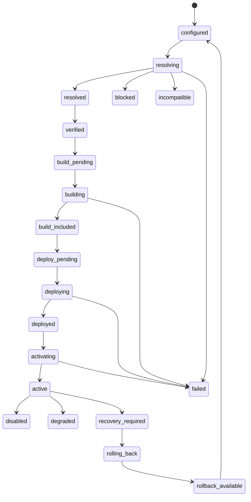

# ADR-0005: Canonical lifecycle orchestration boundary

- Status: proposed
- Date: 2026-07-16
- Parent issue: #92
- Implementation issue: #97

## Context

DevHolm already has transitional plugin lifecycle mutation helpers, marketplace install operation state, rollback history, and canonical multi-axis plugin state contracts. Before Issue #97, those signals were exposed through different surfaces with different vocabulary.

## Decision

Introduce one canonical lifecycle orchestration boundary for mutation entry points and expose a deterministic canonical lifecycle view for admin/API consumers.

### Current boundary shape

- Admin plugin mutations route through a single orchestration facade.
- The marketplace admin API exposes a canonical lifecycle view alongside the legacy UI projection.
- Canonical lifecycle state is represented as separate axes, not a single overloaded enum.

### Canonical view

The canonical lifecycle view derives:

- desired state
- resolution state
- build state
- deployment state
- runtime state
- trust state
- health state
- recovery state

The view is summarized deterministically for UI/API consumption and validated for impossible axis combinations.

### Transitional constraints

- Legacy lifecycle mutation helpers remain in place for compatibility.
- Canonical view exposure does not yet replace every runtime or rollback path.
- Future work should move remaining mutation and recovery semantics behind the same orchestration boundary.

## Consequences

Positive:

- One visible contract for admin/API consumers
- Less drift between the plugin ledger, install operation state, and UI projection
- A stable base for later rollback, recovery, and audit event cutover

Costs:

- Transitional duplication remains until later follow-up issues complete the cutover
- Existing mutation helpers still need deeper consolidation

## Lifecycle State Diagram

The diagram is intentionally conservative. It shows the cross-axis projection used by the current canonical lifecycle view, not a claim that every transition is yet fully wired through a single durable transition ledger.
